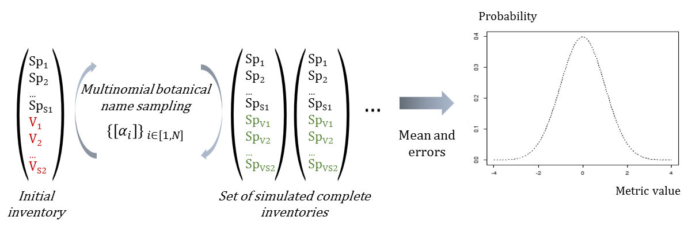

(ref:Bolda) **(a)**

(ref:Boldb) **(b)**

(ref:Boldc) **(c)**

(ref:Boldd) **(d)**

```{r Options, echo=FALSE, message=FALSE, warning=F}
knitr::opts_chunk$set(cache=F, warning=FALSE, tidy=TRUE, tidy.opts=list(blank=FALSE, width.cutoff=40),fig.align="center")
# Installation des packages si nécessaire et chargement
Library <- function(Packages) {
  InstallAndLoad <- function(Package) {
    if (!Package %in% installed.packages()[, 1]) {install.packages(Package, repos="https://cran.rstudio.com/")}
    require(Package, character.only = TRUE)
  }
  invisible(sapply(Packages, InstallAndLoad))
}

Library("kableExtra")
#source("Scripts/GithubPages.R")
source("Scripts/DrawingTools.R")
```

\onecolumn

**Figure S1**: Whenever the family or genus were recorded for a vernacular name, the pool of species sampled to replace the vernacular name was restricted to those pertaining to the same higher taxonomic level (i.e species of the same genus when the species is missing, species of the same family when the genus is missing) \@ref(fig:FigBayesianScheme).

```{r FigBayesianScheme,out.width='100%',fig.cap="Scheme of the Bayesian process propagating the taxonomic uncertainty",echo=F, fig.env='figure',fig.pos='h'}

```


**Figure S2**: Trajectories of seed mass classes proportions over 30 years after disturbance, corresponding to the median (solid line) and 0.025 and 0.975 percentile (gray envelope) observed after 50 iteration of the taxonomic uncertainty propagation. No gap filling process was applied in this case. Initial treatments are represented by solid lines colors with green for control, blue for T1,orange for T2 and red for T3 .

The biodiversity estimator is based on the association probability between vernacular names and botanical species. 
The association probability is estimated by a Dirichlet trial based on the vernacular/botanical association frequency observed in the whole inventory.
This association probability then allows generating theoretical inventories with complete botanical identification with the assignment of botanical species to trees with only a vernacular name.
The repetition of the replacement process produces a set of theoretical inventories which diversities gives the probability distribution of the initial inventory diversity.


```{r FigSeedMassClasses, echo=FALSE, out.width='80%', fig.asp=2/5,fig.cap="Trajectories of seed mass classes proportions over 30 years after disturbance. Colors are treatments: green (control), yellow (T1), orange (T2), red (T3).", fig.env='figure',fig.pos='h'}
load("DB/Smass_ClassProp")

SeedMassProp(Smass)

```


**Figure S3**: Functional PCA

```{r PCA_graphs, out.width = '100%', echo=FALSE, fig.cap="Summarizing plots of the functional PCA analysis defining communities functional space. (ref:Bolda) Plot of the samples from the BRIDGE functional database in the two dimensional main plan. (ref:Boldb) bow plot of the PCA eignevalues in percentage. (ref:Boldc) Plot of the 7 functional traits sed in the PCA analysis (Leaf and stem traits, and maximum species height).", fig.env='figure',fig.pos='h'}
load("DB/FunctionalPCA")

plotPCA(DataACP)


```


